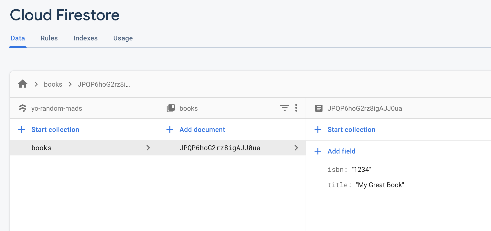

# The very simple Firebase example app

This is the simplest example I could make of using Firebase **user authentication** and **databases**.

It's utilising a package called `react-firebase-hooks` that makes it easier to use Firebase functionality in React.

## Preview

    

## Guide

I'd suggest the following (at least if you haven't worked with Firebase before):

1. Get this example running with my sample Firebase project
2. Set up your own Firebase project and modify this example
3. Once that works, copy over code and files to your own project

---

### 1. Running this example

- Clone this repository to your computer
- enter the folder (`cd firebase-sample-app`)
- Run `npm install` in your terminal
- Run `npm start` in your terminal

**Note:** Since this example is using the same database, if other people adds books they will also appear on your screen - so don't be scared if new items appears :)

### 2. Set up your Firebase project & use it

- Go to [console.firebase.google.com](https://console.firebase.google.com/u/0/) and create a project (give it a name and disable google analytics for now)
- Enable authentication
  - Go to [Authentication](https://console.firebase.google.com/u/0/project/test-44c11/authentication/users) in the left menu
  - select the "Sign-in method" tab
  - click on "Google"
  - toggle the "Enable" switch and select a "support email"
  - save
- Enable Firestore
  - Go to [Firestore](https://console.firebase.google.com/u/0/project/test-44c11/firestore) in the left menu
  - "Create database"
  - "Start in test mode"
  - select some europe-west location
  - enable
- Add your initial datastructure (to have something to test with) - see example of the structure for this example below
- Add a "web app"
  - Go to [Project Overview](https://console.firebase.google.com/u/0/project/test-44c11/overview)
  - Click the round button with `</>` under your project name
  - Don't select "Also set up **Firebase Hosting** for this app" for now and continue
  - Skip the "Add Firebase SDK" section
- Update configuration in the code
  - Still in Firebase dashboard, go into the app settings and under "**Firebase SDK snippet**", select "Config"
  - Copy these details and replace the details in `firebase.js`
  - Replace the value of `const COLLECTION = "books"` in `LoggedInApp.js` with the collection name you chose
- All done, it should now work 🎉

#### The Firestore data structure for this example

### 3. Copy over things

- Look through the code and see which parts you want and need - most likely something from these:
  - `App.js`
  - `firebase.js`
  - `LoggedInApp.js`
  - `NotLoggedInApp.js`
- If you're using packages that I used here (`react-firebase-hooks` and `uuid`), remember to run `npm install PACKAGE_NAME` before running your app - you can find the names in `package.json` under "dependencies"
